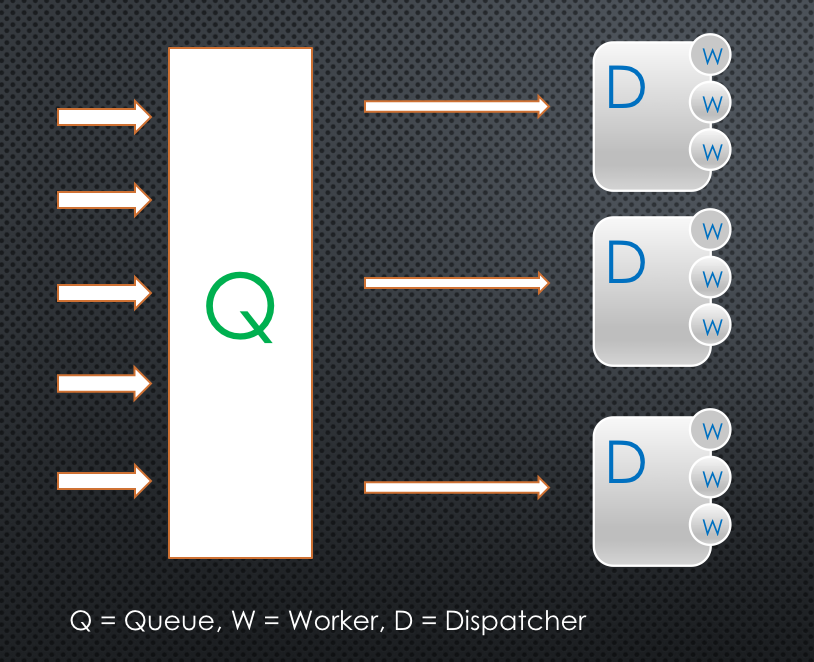

# pool

## makes concurrency easier

### worker pool with job queue

This library is inspired by Golang blog post [Go Concurrency Patterns: Pipelines and cancellation](http://blog.golang.org/pipelines)


### the challenge
While working on a piece of microservice, the goal was to be able to handle a large amount of requests from thousands of endpoints.

The initial implementation started with native Go routines, one Go routine per request, but quickly this was proved to not work very well at a large scale. There is no way to control how many Go routines are spawned. And with the number of requests increasing, it OOMed and crashed.

The second iteration was to create a buffered channel where the requests queueed up and then processed by handler, and since the maximum number of requests in the queue is fixed, there is no more OOM.

The better solution is to utilize the `fan-out` pattern from the blog, to create a 2-tier channel system, one for queuing requests and another to control how many workers operate on the queue concurrently.

### how it works
When the pool is instantiated, it creates a request queue with size `JobQueueBufferSize` and `InitPoolNum` dispatchers with `WorkerNum` workers per dispatcher, each dispatcher reads from the same queue until it is closed, then distribute requests amongst the workers to parallelize.



### Install

```
go get github.com/andy2046/pool
```

### Usage

```go
func main() {
	done := make(chan struct{})
	mu := &sync.RWMutex{}
	data := []int{1, 2, 3, 4, 5, 6, 7, 8, 9, 10}
	sum := 0
	jobHandlerGenerator := func() pool.JobHandler {
		return func(j pool.Job) error {
			mu.Lock()
			defer mu.Unlock()
			sum += j.Data.(int)
			return nil
		}
	}
	size := 2
	opt := func(c *pool.Config) error {
		c.InitPoolNum = size
		c.WorkerNum = 5
		return nil
	}

	p := pool.New(done, jobHandlerGenerator, opt)
	p.Start()

	for i := range data {
		p.JobQueue <- pool.Job{
			Data: data[i],
		}
	}

	close(done)

	// sleep for done channel to finish
	time.Sleep(3 * time.Second)
	mu.RLock()
	log.Println(sum) // 55
	mu.RUnlock()
}
```
